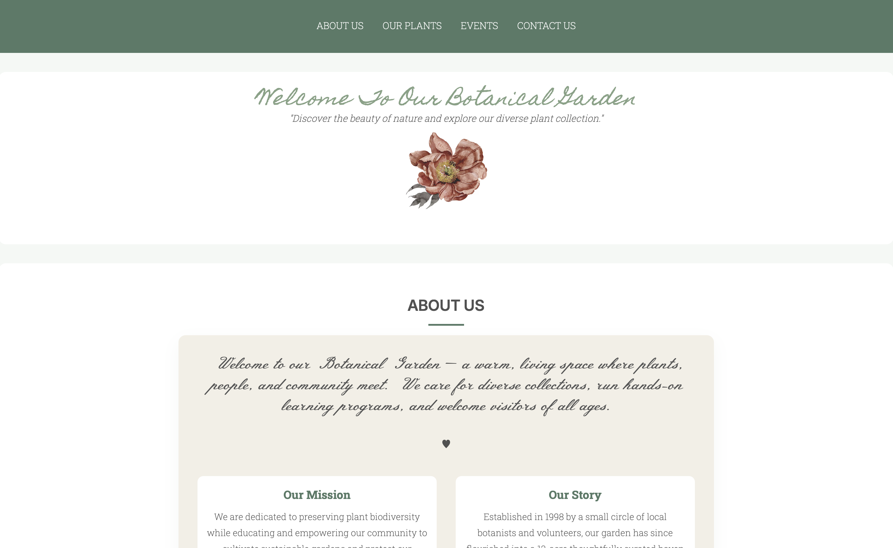
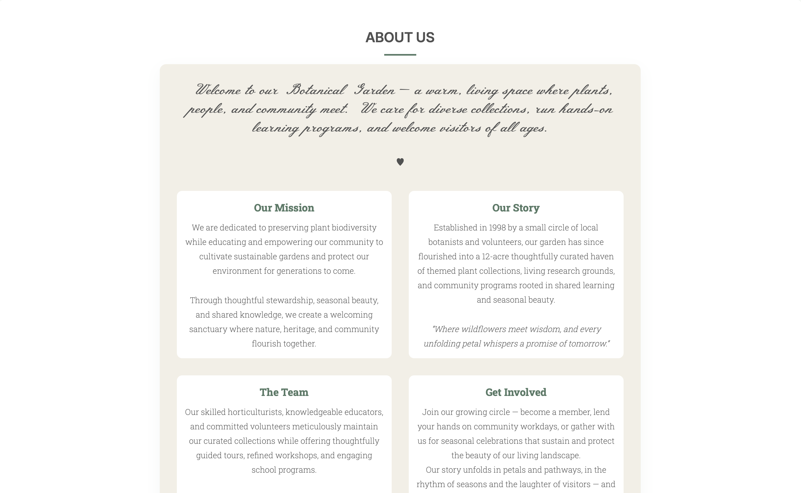
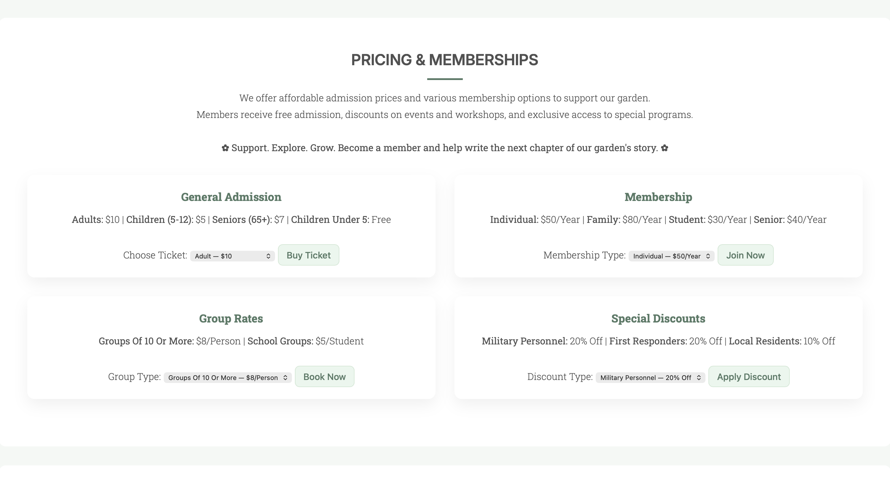
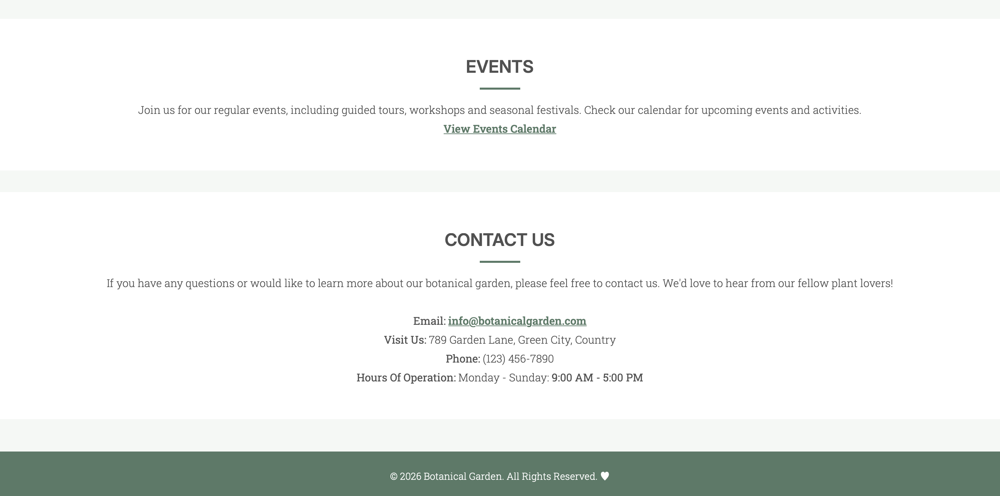
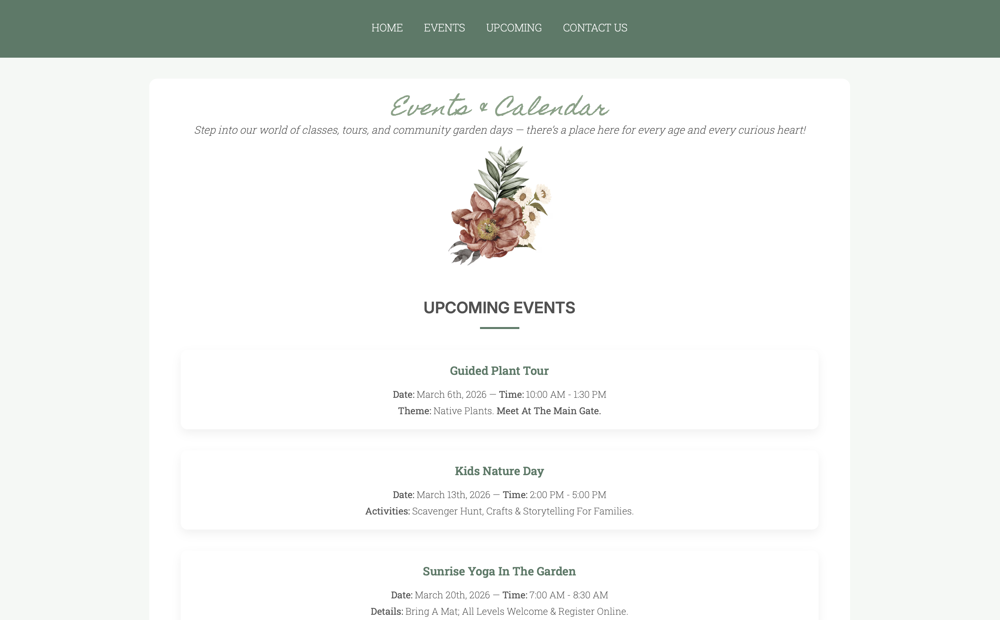
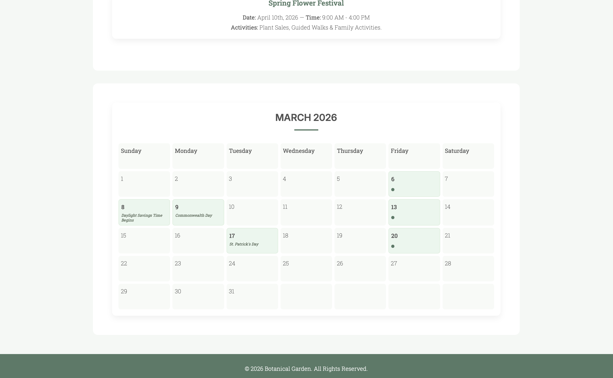

# Botanical Garden ♥︎

A responsive, multi-section botanical garden website designed to showcase plant collections, events, and membership options in a warm, community-focused environment.

This project blends storytelling with structured layout design to create a welcoming digital garden experience.

### Quick Preview

<p align="center"></p>


## Features

- Structured Navigation With Anchor-Based Scrolling
- Themed Content Sections (Mission, Story, Team & Get Involved)
- Grid-Based Plant Collection Layout
- Styled Pricing & Membership Forms
- Clean Semantic HTML5 Architecture
- Responsive Viewport Configuration
- Cohesive Branding & Storytelling Integration
- Custom Styling Via External CSS


## Technologies Used

- HTML5 (Semantic Layout & Accessibility Structure)
- CSS3 (Grid Layouts, Styling & Visual Hierarchy)
- Form Elements & UI Structuring
- Responsive Layout Principles


## Project Structure

```text
Botanical-Garden/
├── index.html               # Main Homepage
├── events.html              # Events Page
├── style.css                # Styles For The Site
├── README.md                # Project Documentation & Showcase
├── images/                  # Images Used For The Website
│   ├── brown-flower2.avif
│   ├── canna-glauca.jpg
│   ├── curcuma-longa.jpg
│   └── ...                  # Other Plant Images
└── screenshots/             # Visuals For README Preview
        ├── homepage.png
        ├── about-section.png
        ├── plants-grid.png
        ├── pricing-section.png
        ├── upcoming-events.png
        ├── calendar.png
        └── BotanicalGarden.gif  # Demo GIF Showing Site Flow
```


## Website Screenshots

### Home Section


### About Section


### Plant Collection Grid


### Pricing & Membership


### Events & Contact Us Section


### Upcoming Events


### Calendar



## Purpose Of The Project

This project was developed to strengthen my understanding of semantic HTML architecture and scalable front-end layout design. It focuses on building a structured, multi-section user interface using grid systems, organized content hierarchy and interactive form components.

Beyond technical structure, the project also explores cohesive brand storytelling — ensuring that the layout, typography and content work together to create a consistent and immersive user experience.


## Future Improvements

- Add JavaScript Functionality For Form Validation
- Implement Ticket/Membership Checkout Logic
- Add Event Filtering System
- Deploy Live Version
- Add Animations For Smoother UX
- Convert To A Full-Stack Application With Backend Integration


## How To Run Locally

1. Clone The Repository
2. Open The Project Folder
3. Launch `index.html` In Your Browser


### Author

**Ruaa Abdelrahman**  
Full Stack Web Development Student  
